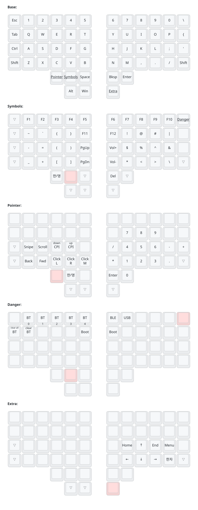

# ZMK config for Charybdis (4x6)

Personal ZMK configuration for a wireless Charybdis 4x6 split keyboard with a
PMW3610 trackball on the right half.

It runs as a dongle plus two peripherals on the Zephyr 4.1 based, pre-v0.4 ZMK
line. The dongle is the only central and reaches the host over USB, with ZMK
Studio on the same link; both halves talk to it over BLE split.

Split ran on ESB for a while, which cut the hop from roughly 7.5 ms to 1 ms.
That was reverted: the ESB module has no encryption or authentication, so key
positions travelled in the clear and nothing stopped injected or replayed
packets. BLE split bonds and encrypts. The ESB work is kept on the `esb`
branch and the `esb-dongle-verified` tag in case that changes.

The trackball runs on [badjeff/zmk-pmw3610-driver][pmw]. Snipe and drag scroll
are layer-swapped input processor chains on the dongle rather than driver
features, so the old `PMW_*` keymap bindings are gone.

[pmw]: https://github.com/badjeff/zmk-pmw3610-driver

## Firmware

Four targets: `charybdis_dongle`, `charybdis_left`, `charybdis_right`, and
`settings_reset`. Flash `settings_reset` on a board before its first firmware.

A second keyboard set needs no configuration of its own. BLE bonding keeps
sets apart, so two of them can sit side by side — which was not true on ESB,
where the address had to be managed by hand.

## Keymap



- **Base** is QWERTY with the number row on the top. The left thumb cluster
  holds the Pointer and Symbols layer keys, the right one Backspace, Enter and
  the Extra layer key.
- **Hangul/English** is Pointer and Symbols pressed together (`RAlt`). It sits
  on the Pointer key in the Symbols layer and on the Symbols key in the Pointer
  layer, so whichever is pressed second fires it, with no combo delay.
- **Symbols** carries `! @ # $ % ^ & *` on `U I O J K L ; M`, the brackets,
  F-keys, Page Up/Down and volume. The Danger layer (Bluetooth profiles, output
  selection, bootloader) is reached from its top right key.
- **Pointer** has the mouse buttons, the CPI step keys, Snipe and Scroll
  (held, see below) and a numpad on the right half.
- **Extra** has Home, End, the arrow keys, Menu and Hanja; the modifiers stay
  active on it.
- Scroll and Snipe are fully transparent layers that only switch the
  trackball's input processors, so they are not drawn. Symbols also turns the
  trackball into a scroll wheel while it is held.

The picture is generated by [keymap-drawer][kd] from `config/charybdis.keymap`.
After changing the keymap, regenerate it from the repository root:

```bash
pip install keymap-drawer
keymap -c docs/keymap/config.yaml parse -z config/charybdis.keymap -o docs/keymap/keymap.yaml
keymap -c docs/keymap/config.yaml draw -j docs/keymap/layout.json \
    -s Base Symbols Pointer Extra Danger -o docs/keymap/keymap.svg docs/keymap/keymap.yaml
```

`layout.json` holds the key positions (the same as `charybdis_layout.dtsi`) and
`config.yaml` the label mapping.

[kd]: https://github.com/caksoylar/keymap-drawer

## Documentation

- [Dongle and ESB research](docs/dongle-esb-research.md)
- [Dongle and ESB migration plan](docs/dongle-esb-migration.md)
